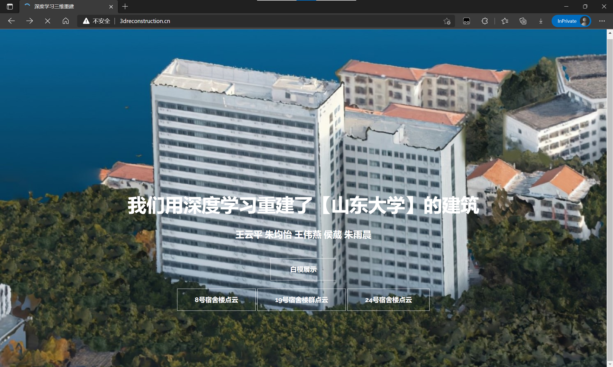
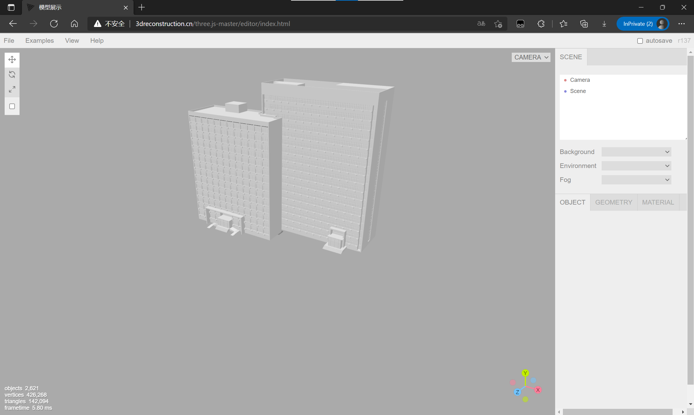
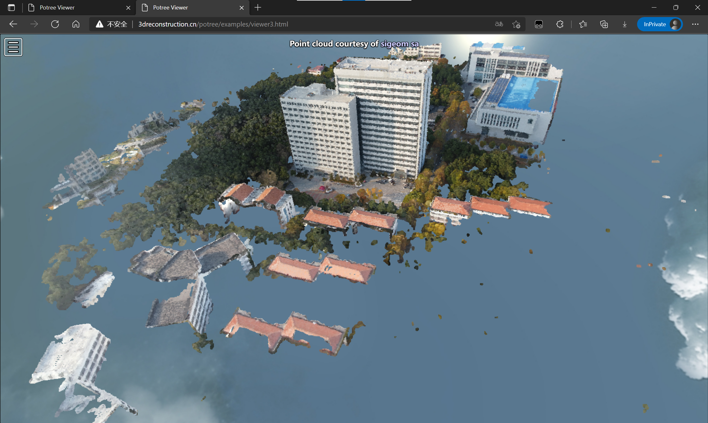

# 三维重建网站

## 基本介绍
关于对建筑物图片进行三维重建以及目标识别，请参考我们项目的[第一部分](https://github.com/wechat-haibei/3D-deeplearning-processing)。

以下将主要介绍项目的第二部分：白模与点云的网页展示。

1. 对于白模，我们使用[Three.js](https://threejs.org/)进行加载；

2. 对于项目第一部分建立的点云模型，我们使用[potree](https://potree.github.io/)进行加载;
3. 我们通过[nginx](https://nginx.org/en/)进行服务器的部署配置

如想了解我们的展示效果，请参阅我们的[网站链接](http://3dreconstruction.cn)。
包含我们给出的点云与白模结果的代码文件请参阅[此处](https://pan.baidu.com/s/1phJdGIBuUiBdCoqAKq_OJQ?pwd=6pd7) (提取码：6pd7)。

下面展示几张网站截图：





## potree（点云加载）本地调试


1. 安装[node.js](http://nodejs.cn/download/)
2. 在本项目目录下打开终端：
    
    ```
    cd potree
    npm install
    npm start
    ```
    浏览器中键入 http://localhost:8081 即可浏览点云模型。
3. 加载其他自定义模型：
    
    将您的点云文件转换成`las/laz`格式，可使用[cloudcompare](https://www.cloudcompare.org/)进行转换;

    将您的`las/laz`格式的点云模型存入pointclouds文件夹下，通过[PotreeConverter](https://github.com/potree/PotreeConverter/releases)转换成potree可读取的形式,在`PotreeConverter.exe`所在位置打开终端，进一步转换点云格式：
    ```
    ./PotreeConverter.exe root/potree/pointclouds/data.las -o root/potree/pointclouds/data_converted
    ```
    这样，`potree/pointclouds/data_converted`文件夹下的文件如下所示：

    ```
    pointclouds
        ├──data_converted
            ├── hierarchy.bin 
            ├── metadata.json   
            └── octree.bin  
    ```
    在`potree/examples`文件夹下，将`viewer.html`下述代码替换成：
    ```
    let url = "../pointclouds/data_converted/metadata.json";
    ```
    保存后重新运行`npm start`，即可在浏览器对应路径下看到加载的自定义模型。

## three.js本地调试

1. 类似地,我们安装好Node.js之后，通过  

    ```
    cd three.js-master
    npm install
    npm start
    ```
    浏览器中键入 http://localhost:8080 (或其他终端所示地址) 即可浏览。
2. 加载自定义模型：
    在上述页面中，通过`Examples`栏可浏览我们给出的建筑物白模。  
    如要加载自定义模型，请通过`File-Import`导入您的本地模型。  
    如欲将您的模型固定在example栏中，请在已显示出您的模型的上述页面中，通过`File-Export Scene`得到scene.json，
    放在`three.js-master/editor/examples`路径下，并在该scene.json文件头部添入：
    ```
    {
	"metadata": {
		"type": "App"
	},
	"project": {
		"shadows": true,
		"vr": false
	},
	"camera": {
		"metadata": {
			"version": 4.5,
			"type": "Object",
			"generator": "Object3D.toJSON"
		},
		"object": {
			"uuid": "4AC7ADED-CC22-4B16-8218-2E0A0C38C8F8",
			"type": "PerspectiveCamera",
			"name": "Camera",
			"layers": 1,
			"matrix": [0.605503,0,-0.795843,0,-0.261526,0.944464,-0.198978,0,0.751645,0.328615,0.571876,0,2.571484,1.124239,1.956469,1],
			"fov": 50,
			"zoom": 1,
			"near": 0.1,
			"far": 10000,
			"focus": 10,
			"aspect": 1.428977,
			"filmGauge": 35,
			"filmOffset": 0
		}
	},
	"scene": 
    ```
    并在尾部添上`}`，重命名为`scene.app.json`  
    保存该文件之后，在`three.js-master/editor/js/Menubar.js`对应位置添入如下内容:
    ```
    { title: 'menubar/examples/custom', file: 'scene.app.json' },
    ```
    在`three.js-master/editor/js/Strings.js`对应位置（约70行处）添入如下内容：
    ```
    'menubar/examples/custom':'custom model',
    ```
    保存并重新运行`npm start`，即可在页面中通过`Examples-custom model`加载您的自定义模型。
## 上传并通过nginx部署服务器

将您的项目上传到服务器上。我们假定服务器上您的项目目录为`/website`。  
请先在您的服务器上安装[nginx](https://nginx.org/en/)。  
安装并调试完成后，修改`nginx.conf`的如下内容（可以根据您的需要进行配置）：
```
 server {
        listen       80 default_server;
        listen       [::]:80 default_server;
        server_name  your_domain  www.your_domain;
        location / {
            root    /website;
            index   index.html; #您的首页html路径 
            try_files $uri $uri/ =404;
        }
```
修改完成后通过`nginx -s reload`重启nginx服务；

至此nginx服务器部署完成。


